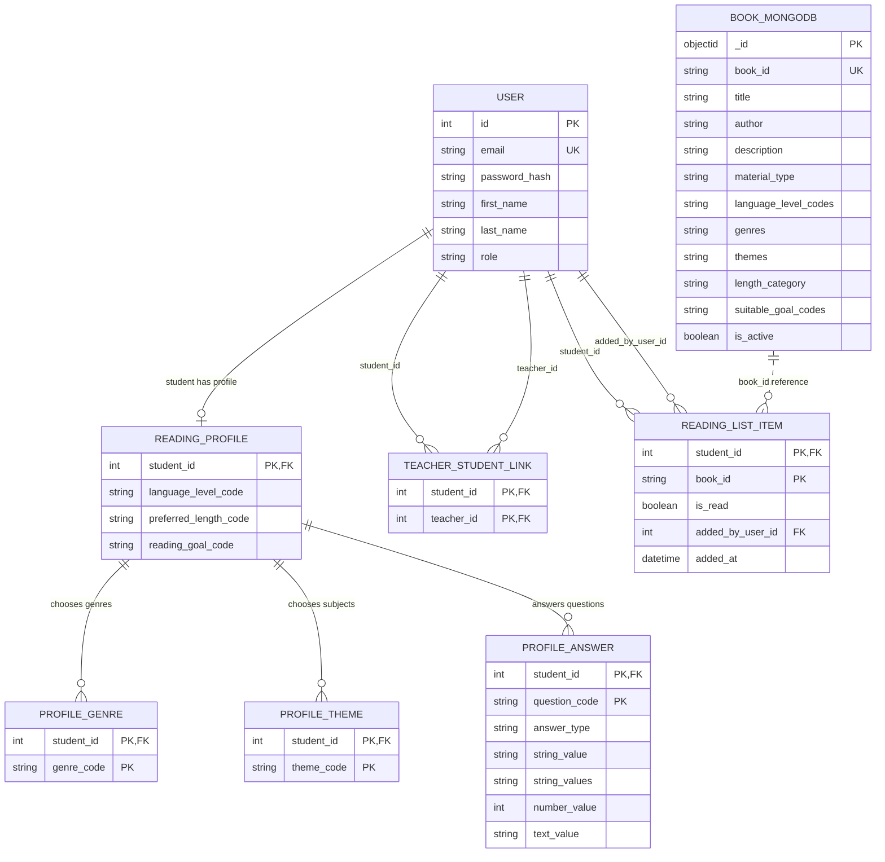

```mermaid
erDiagram

    USER {
        int id PK
        string email UK
        string password_hash
        string first_name
        string last_name
        string role
    }

    READING_PROFILE {
        int student_id PK, FK
        string language_level_code
        string preferred_length_code
        string reading_goal_code
    }

    PROFILE_GENRE {
        int student_id PK, FK
        string genre_code PK
    }

    PROFILE_THEME {
        int student_id PK, FK
        string theme_code PK
    }

    PROFILE_ANSWER {
        int student_id PK, FK
        string question_code PK
        string answer_type
        string string_value
        string string_values
        int number_value
        string text_value
    }

    TEACHER_STUDENT_LINK {
        int student_id PK, FK
        int teacher_id PK, FK
    }

    READING_LIST_ITEM {
        int student_id PK, FK
        string book_id PK
        boolean is_read
        int added_by_user_id FK
        datetime added_at
    }

    BOOK_MONGODB {
        objectid _id PK
        string book_id UK
        string title
        string author
        string description
        string material_type
        string language_level_codes
        string genres
        string themes
        string length_category
        string suitable_goal_codes
        boolean is_active
    }

    USER ||--o| READING_PROFILE : "student has profile"

    READING_PROFILE ||--o{ PROFILE_GENRE : "chooses genres"
    READING_PROFILE ||--o{ PROFILE_THEME : "chooses subjects"
    READING_PROFILE ||--o{ PROFILE_ANSWER : "answers questions"

    USER ||--o{ TEACHER_STUDENT_LINK : "student_id"
    USER ||--o{ TEACHER_STUDENT_LINK : "teacher_id"

    USER ||--o{ READING_LIST_ITEM : "student_id"
    USER ||--o{ READING_LIST_ITEM : "added_by_user_id"

    BOOK_MONGODB ||..o{ READING_LIST_ITEM : "book_id reference"
```